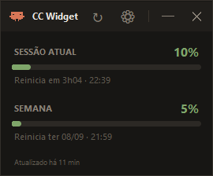
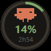
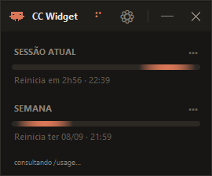
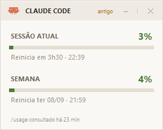
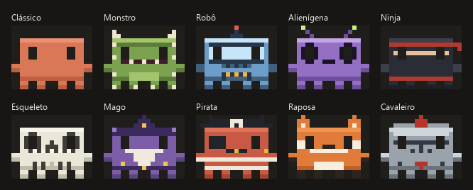
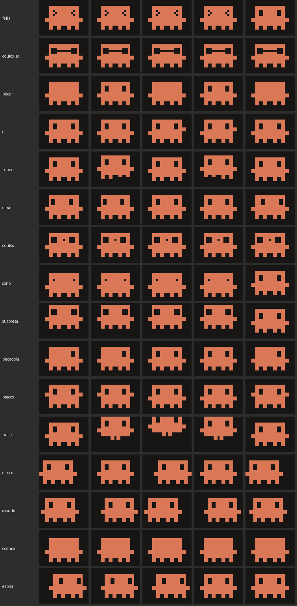

<div align="center">


# CC Widget

**Seus limites do Claude Code na área de trabalho: sessão de 5 horas e limite semanal, sempre acima das outras janelas.**




Projeto não-oficial

</div>

---

## Requisitos

- Windows com Python 3.10 ou mais novo
- CLI do Claude Code no `PATH` (o widget o executa)
- Nenhum pacote a instalar: só a biblioteca padrão

## Instalação

```powershell
git clone https://github.com/Luis-lhgdf/claudecode-usage-widget.git
cd claudecode-usage-widget

.\scripts\install.ps1
```

O instalador cria o atalho na área de trabalho, registra a versão e abre o widget. Ele não coloca nada na inicialização do Windows — o widget abre quando você clicar. Clicar no atalho de novo não abre uma segunda cópia: traz a que já está aberta para frente.

| Arquivo | Para que serve |
|---|---|
| `scripts/install.ps1` | **Instala.** Cria o atalho da área de trabalho com o ícone do mascote e abre o widget. Rodar de novo é seguro: compara a versão do repositório com a registrada e diz se é instalação, atualização ou reinstalação |
| `scripts/uninstall.ps1` | **Desinstala.** Fecha o widget e remove o atalho. Pergunta no terminal se as preferências ficam ou se `~/.ccwidget` vai embora também (`-Manter` e `-Tudo` respondem de antemão) |
| `run_widget.pyw` | **Abre o widget** sem passar pelo instalador. A extensão `.pyw` faz o Windows usar `pythonw.exe`, sem janela de console |

Para atualizar, basta `git pull` e rodar o instalador de novo — ele reinicia o widget na versão nova. Não é preciso lembrar de conferir: uma vez por dia o widget lê a versão publicada no GitHub e avisa no painel quando há uma mais nova, com o comando pronto para copiar (**⚙ › Avisar de novas versões** desliga a checagem, e com ela qualquer acesso à rede).

## Modos

<table>
<tr>
<td align="center" width="35%"><br><b>Minimizado</b><br><sub>Percentual e tempo até o reset</sub></td>
<td align="center" width="65%"><br><b>Painel</b><br><sub>Sessão atual e semana</sub></td>
</tr>
</table>

## Controles

| Ação | Resultado |
|---|---|
| `↻` | Consulta o `/usage` agora |
| `⚙` ou botão direito | Menu: modo, tema, mascote, intervalo, opacidade, animações, aviso de versão |
| `↑ Versão x.y.z disponível` | Abre o comando de atualização, com botão para copiar |
| `─` | Minimiza para o círculo |
| `✕` ou `Esc` | Fecha |
| Arrastar cabeçalho ou círculo | Move |
| Clicar no círculo | Abre o painel |

## De onde vêm os números

Uma fonte só, a oficial: o widget roda `claude -p "/usage"` e interpreta a saída. É comando local, sem resposta de modelo — **não consome tokens**. A primeira consulta sai ao abrir a janela; depois roda a cada 10 minutos (no menu: 30 s, 1, 2, 5, 10, 15, 30, 60 minutos ou só manual) e sob demanda no `↻`.

Durante a consulta a seta gira e as barras viram um segmento correndo na pista. Sem dado, o widget mostra `--` e diz que não tem dado — ele não estima consumo por conta própria.

<div align="center">

</div>

## Tema

Claro e escuro, seguindo o Windows por padrão. Fixe um dos dois no menu.

<div align="center">

</div>

## Mascote

Dez aparências em **⚙ › Mascote**. Todas partem do mesmo corpo de 19 × 12
blocos e mudam só o que se pinta sobre ele: cores próprias, luz no alto e
sombra embaixo, traços dentro do corpo — bocarra, viseira, costelas, focinho —
e acessórios de até três linhas acima da cabeça.

Cada aparência mora no próprio arquivo, em `ccwidget/skins/`.

<div align="center">

</div>

## Animações

Ao abrir, o mascote cumprimenta e sobe para o cabeçalho enquanto o painel
aparece; ao fechar, desce, se despede e sai de cena. No modo minimizado ele faz
uma de dezesseis gracinhas a cada 25–70 segundos.

<div align="center">

</div>

Tudo isso se desliga em **⚙ › Animações** — aí o widget abre e fecha na hora.

## Terminal

```bash
python -m ccwidget usage     # consulta e grava
python -m ccwidget report    # imprime os percentuais
```

## Configuração

Tudo em `~/.ccwidget/config.json`: modo, tema, posição, opacidade, `usage_refresh_minutes` (`0` deixa a consulta só no menu, mas a primeira, ao abrir, acontece de qualquer forma), `update_check` (`false` desliga o aviso de versão nova e qualquer acesso à rede) e a versão instalada. O menu cobre as preferências; a versão quem escreve é o instalador.

## Estrutura

```
ccwidget/
  usage_cli.py     roda o `claude -p /usage` e interpreta a saída
  state.py         lê e grava o último resultado
  theme.py         paletas, mascote e formas com antialiasing
  skins/           uma aparência por arquivo; base.py traz as ferramentas
  ui.py            o widget tkinter
  config.py        preferências
  update_check.py  lê a versão publicada e monta o comando de atualização
  __main__.py      entrada (widget / usage / report)
run_widget.pyw     abre sem console
scripts/           install.ps1, uninstall.ps1, funções comuns e render_skins.py
assets/            ícone do mascote (.ico)
```

## Desinstalar

```powershell
.\scripts\uninstall.ps1
```

Ele pergunta no terminal o que fazer com as preferências — manter, para uma reinstalação devolver o widget como estava, ou apagar `~/.ccwidget` junto — e cancela sem tocar em nada se você mudar de ideia. Para responder de antemão, em scripts: `-Manter` ou `-Tudo`.

---

## English

Floating desktop widget for Claude Code limits — 5-hour session window and weekly limit, always on top, minimized ring or full panel, light and dark themes.

Numbers come from one official source: the widget runs `claude -p "/usage"` and parses its output. Local command, no model response, no tokens spent; on open, then every 10 minutes (configurable: 30 s to 1 h, or manual only) and on demand. It never estimates usage on its own — with no data, it says so.

Requires the Claude Code CLI on `PATH` and Python 3.10+. No packages to install. **Interface is in Portuguese.**

```powershell
pythonw run_widget.pyw
python -m ccwidget report
```

---

## Licença

MIT — veja [LICENSE](LICENSE). Histórico em [CHANGELOG.md](CHANGELOG.md).

Sem vínculo com a Anthropic. "Claude" é marca da Anthropic, PBC; o mascote é desenhado em código (`ccwidget/theme.py` e `ccwidget/skins/`), nenhum arquivo de marca acompanha o repositório. O projeto apenas executa um comando público do CLI e lê o resultado.
