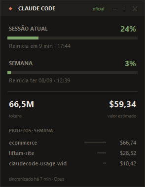
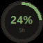
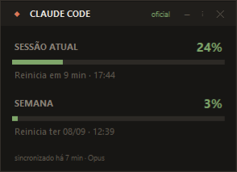

<div align="center">

# Claude Code Usage Widget

**Widget flutuante que mostra seu consumo do Claude Code direto na área de trabalho: sessão de 5 horas, limite semanal, tokens e valor equivalente. Sempre acima das outras janelas.**



Windows · Python 3.10+ · sem dependências · projeto não-oficial

</div>

---

## Por quê

Celular tem widget para tudo. Computador, quase nada. E o número que realmente importa enquanto você trabalha — *quanto já foi da minha janela de 5 horas?* — fica escondido atrás do `/usage`, que você precisa parar e digitar.

Isso põe o número na tela, permanentemente.

## Três modos

Alterne pelo botão `⋮`, por duplo clique no cabeçalho, ou clicando no círculo.

<table>
<tr>
<td align="center" width="33%"><br><b>Minimizado</b><br><sub>Só o círculo, com anel<br>de progresso da sessão</sub></td>
<td align="center" width="33%"><br><b>Resumo</b><br><sub>Sessão atual e semana</sub></td>
<td align="center" width="33%"><br><b>Completo</b><br><sub>+ tokens, valor e projetos</sub></td>
</tr>
</table>

## Como funciona

O widget lê duas fontes e deixa explícito de onde vem cada número.

**1. Percentuais oficiais — pela status line**

O Claude Code entrega um JSON para o comando configurado como `statusLine`, e esse JSON traz os números reais:

```json
"rate_limits": {
  "five_hour": { "used_percentage": 23.5, "resets_at": 1738425600 },
  "seven_day": { "used_percentage": 41.2, "resets_at": 1738857600 }
}
```

Este projeto instala uma ponte como sua status line. Ela grava esse payload em `~/.ccwidget/state.json` e devolve uma status line compacta ao terminal, para a linha não ser desperdiçada:

```
◆ Opus │ ctx 62% │ 5h ██░░░░░░░░ 21% ↻37min │ 7d 3% │ $1.23
```

Sem chamada de API, sem gastar token, sem polling — apenas aproveita uma renderização que já ia acontecer (~60 ms).

**2. Tokens, valor e projetos — dos logs locais**

O Claude Code grava cada sessão em `~/.claude/projects/**/*.jsonl`. O widget lê esses arquivos para tokens, valor equivalente e ranking por projeto.

Dois detalhes importam aqui, e errá-los é o motivo usual de medidores caseiros reportarem números inflados:

- **Deduplicação.** Uma única resposta da API é gravada em *várias* linhas — uma por bloco de conteúdo — cada uma repetindo o mesmo objeto `usage`. Contar linha a linha infla os totais em cerca de 3×. Aqui a deduplicação é por `requestId`.
- **Leitura incremental.** Reprocessar centenas de arquivos a cada atualização é lento. O offset em bytes de cada arquivo é guardado, então só o conteúdo novo é lido. Carga inicial ≈ 2,5 s para 23 mil requisições; cada atualização seguinte ≈ 20 ms.

## Instalação

```powershell
git clone https://github.com/Luis-lhgdf/claudecode-usage-widget.git
cd claudecode-usage-widget

# 1. alimenta o widget com os percentuais oficiais
.\scripts\install-statusline.ps1

# 2. (opcional) abre junto com o Windows
.\scripts\install-startup.ps1
```

Depois abra uma sessão do Claude Code e envie uma mensagem — `rate_limits` só aparece após a primeira resposta da API. Para abrir o widget:

```powershell
pythonw run_widget.pyw
```

O `install-statusline.ps1` faz backup do `settings.json` antes de mexer, e se recusa a sobrescrever uma status line existente sem `-Force`.

## Uso

| Ação | Resultado |
|---|---|
| Arrastar o cabeçalho (ou o círculo) | Move o widget |
| Clicar no círculo | Abre o modo resumo |
| Duplo clique no cabeçalho | Alterna resumo ↔ completo |
| `–` | Minimiza para o círculo |
| `⋮` ou botão direito | Menu: modos, sempre visível, projetos, opacidade |
| `✕` ou `Esc` | Fecha |

Prefere o terminal? Os mesmos números, sem janela:

```bash
python -m ccwidget report
```

Posição, modo, opacidade e preferências ficam em `~/.ccwidget/config.json`.

## Lendo os números

O selo no canto superior direito diz de onde vêm os percentuais:

| Selo | Significado |
|---|---|
| `oficial` | Números vivos da status line — idênticos aos do `/usage` |
| `cache` | Números oficiais, mas nenhuma sessão renderizou recentemente |
| `local` | Sem dado oficial; a barra da sessão mostra o *tempo decorrido* da janela, não o consumo |

**Tudo com o prefixo `~` é estimativa.** O valor em dólar é *equivalente de API*, não cobrança: em assinatura Pro/Max/Team você não paga por token. Serve para comparar sessões e ver quanto sua assinatura vale — não para prever fatura.

## Precisão e limites

Dito de forma direta, porque medidor que exagera a própria precisão é pior que medidor nenhum:

- **`rate_limits` exige assinatura Claude.ai Pro ou Max** (ou um gateway com limite de gasto), e só aparece depois da primeira resposta da API na sessão. Sem ele, o widget cai para as estimativas locais e sinaliza isso no selo.
- **Os logs locais cobrem apenas esta máquina.** Outros dispositivos e o claude.ai não entram — a mesma ressalva que o próprio `/usage` faz. Em teste, um bloco de 5 horas havia começado 11 minutos antes do registro local mais antigo, por uso em outro dispositivo. Os percentuais oficiais não têm esse problema; as estimativas locais têm.
- **O valor vem dos preços públicos da API** (`ccwidget/pricing.py`), com os multiplicadores de cache: 1,25× o input para escrita de 5 minutos, 2× para 1 hora, 0,1× para leitura. Modelos desconhecidos usam a faixa Opus.
- **O widget não atualiza os números oficiais sozinho.** Eles mudam quando o Claude Code renderiza a status line. Se você ficou um tempo sem usar, o selo mostra `cache` e o rodapé informa há quanto tempo.

## Estrutura

```
ccwidget/
  collector.py   leitura incremental dos JSONL, dedup por requestId
  analytics.py   blocos de 5h, janela semanal, agrupamentos
  pricing.py     tabela de preços por modelo e cálculo de custo
  state.py       lê o que a status line publicou
  statusline.py  a ponte: grava o estado e imprime a status line
  ui.py          o widget tkinter, com os três modos
  __main__.py    entrada (widget / report / statusline)
statusline_hook.py   o que o Claude Code invoca
run_widget.pyw       abre sem janela de console
scripts/             instaladores PowerShell
```

## Desinstalar

```powershell
.\scripts\install-startup.ps1 -Remove
```

Depois apague a chave `statusLine` de `~/.claude/settings.json` (há um backup datado ao lado) e remova a pasta `~/.ccwidget/`.

---

## English

A floating desktop widget for Claude Code usage: 5-hour session window, weekly limit, tokens and API-equivalent value — always on top, with three modes (a minimized ring, a summary, and a full panel).

The percentages are **the official ones**. Claude Code hands a JSON payload containing `rate_limits` to whatever command you set as your `statusLine`; this project installs a small bridge there, which stores the payload for the widget and prints a compact status line back to your terminal. No API calls, no tokens spent, ~60 ms per render. Tokens, cost and the per-project ranking come from the local session logs in `~/.claude/projects`, deduplicated by `requestId` (a single response is written as several lines repeating the same `usage` object — counting them raw inflates totals ~3×) and read incrementally via cached byte offsets.

Requires a Pro or Max subscription for the official percentages; without them the widget falls back to local estimates and labels them. Local logs only cover this machine, not other devices or claude.ai. Anything prefixed `~` is an estimate, and the dollar figure is API-equivalent value, not a charge.

**The interface is in Portuguese.** Install with `.\scripts\install-statusline.ps1`, run with `pythonw run_widget.pyw`, or use `python -m ccwidget report` for a terminal summary.

---

## Licença

MIT — veja [LICENSE](LICENSE).

Sem vínculo com a Anthropic. "Claude" é marca da Anthropic, PBC. Este projeto apenas lê arquivos locais que o Claude Code já grava; não modifica o Claude Code nem chama nenhuma API privada.
