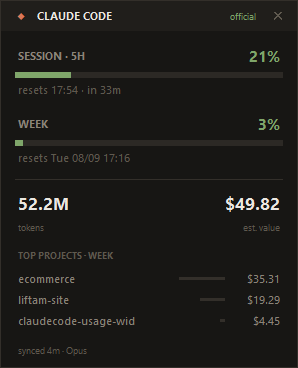

<div align="center">

# Claude Code Usage Widget

**A floating desktop widget that shows your Claude Code usage — 5-hour session, weekly limit, tokens and cost — always on top, always current.**



Windows · Python 3.10+ · no dependencies · unofficial

</div>

---

## Why

Phones have widgets for everything. Desktops mostly don't. And the number that actually matters while you work — *how much of my 5-hour window is gone?* — is buried behind `/usage`, which you have to stop and type.

This puts it on your screen permanently.

## How it works

The widget reads two sources and is explicit about which one each number comes from.

**1. Official percentages — via the status line**

Claude Code passes a JSON payload to whatever command you configure as your `statusLine`, and that payload contains the real numbers:

```json
"rate_limits": {
  "five_hour": { "used_percentage": 23.5, "resets_at": 1738425600 },
  "seven_day": { "used_percentage": 41.2, "resets_at": 1738857600 }
}
```

This project installs a tiny bridge as your status line. It writes that payload to `~/.ccwidget/state.json` and prints a compact status line back to your terminal, so the row isn't wasted:

```
◆ Opus │ ctx 62% │ 5h ██░░░░░░░░ 21% ↻37min │ 7d 3% │ $1.23
```

No API calls, no tokens spent, no polling — it just piggybacks on a render that was going to happen anyway (~60 ms).

**2. Tokens, cost and projects — from local session logs**

Claude Code writes every session to `~/.claude/projects/**/*.jsonl`. The widget parses those for token counts, cost and per-project breakdown.

Two details matter here, and getting them wrong is the usual reason homemade usage trackers report inflated numbers:

- **Deduplication.** A single API response is written as *several* lines — one per content block — each repeating the same `usage` object. Counting line by line inflates totals by roughly 3×. This project deduplicates by `requestId`.
- **Incremental reads.** Re-parsing hundreds of files every refresh is slow. Byte offsets are cached per file, so only new content is read. Cold start ≈ 2.5 s over 23k requests; every refresh after that ≈ 20 ms.

## Install

```powershell
git clone https://github.com/Luis-lhgdf/claudecode-usage-widget.git
cd claudecode-usage-widget

# 1. feed the widget the official percentages
.\scripts\install-statusline.ps1

# 2. (optional) launch it with Windows
.\scripts\install-startup.ps1
```

Then open a Claude Code session and send one message — `rate_limits` only appears after the first API response. Launch the widget with:

```powershell
pythonw run_widget.pyw
```

`install-statusline.ps1` backs up `settings.json` before touching it, and refuses to overwrite an existing status line unless you pass `-Force`.

## Usage

| Action | Result |
|---|---|
| Drag the header | Move the widget |
| Right-click | Menu: always on top, projects, opacity, refresh, quit |
| Double-click | Refresh now |
| `✕` or `Esc` | Close |

Prefer the terminal? Same numbers, no window:

```bash
python -m ccwidget report
```

Position, opacity and preferences persist in `~/.ccwidget/config.json`.

## Reading the numbers

The badge in the top-right tells you where the percentages come from:

| Badge | Meaning |
|---|---|
| `official` | Live figures from the status line — identical to `/usage` |
| `cached` | Official figures, but no session has rendered recently |
| `local` | No official data; the session bar shows *window elapsed*, not consumption |

**Anything prefixed with `~` is an estimate.** The dollar figure is *API-equivalent value*, not a charge: on a Pro/Max/Team subscription you don't pay per token. It's useful for comparing sessions and for seeing what your subscription is worth — not for predicting a bill.

## Accuracy and limits

Stated plainly, because usage tools that overstate their precision are worse than no tool:

- **`rate_limits` requires a Claude.ai Pro or Max subscription** (or a Claude apps gateway with a spend limit), and appears only after the first API response of a session. Without it, the widget falls back to local estimates and labels them as such.
- **Local logs only cover this machine.** Other devices and claude.ai aren't included — the same caveat `/usage` itself carries. In testing, a 5-hour block had actually started 11 minutes before the earliest local log entry, because of activity on another device. The official percentages don't have this problem; the local estimates do.
- **Cost is computed from public API prices** (`ccwidget/pricing.py`), including the cache multipliers: 1.25× input for a 5-minute write, 2× for 1-hour, 0.1× for reads. Unknown models fall back to Opus-tier pricing.
- **The widget doesn't refresh the official numbers on its own.** They update when Claude Code renders its status line. If you haven't used it in a while, the badge says `cached` and the age is shown in the footer.

## Layout

```
ccwidget/
  collector.py   incremental JSONL reader, dedup by requestId
  analytics.py   5-hour blocks, weekly windows, grouping
  pricing.py     model price table and cost math
  state.py       reads what the status line published
  statusline.py  the bridge: writes state, prints the status line
  ui.py          the tkinter widget
  __main__.py    entry point (widget / report / statusline)
statusline_hook.py   what Claude Code invokes
run_widget.pyw       launches without a console window
scripts/             PowerShell installers
```

## Uninstall

```powershell
.\scripts\install-startup.ps1 -Remove          # remove from startup
```

Then delete the `statusLine` key from `~/.claude/settings.json` (a timestamped backup sits next to it) and remove `~/.ccwidget/`.

---

## Português

Widget flutuante que mostra seu consumo do Claude Code direto na área de trabalho: sessão de 5 horas, limite semanal, tokens e valor equivalente.

Os percentuais são **os oficiais** — vêm do mesmo lugar que o `/usage`, através de uma ponte instalada como status line do Claude Code, sem gastar tokens nem fazer chamadas de API. Tokens, custo e ranking de projetos saem dos logs locais de sessão.

Instalação:

```powershell
.\scripts\install-statusline.ps1     # alimenta os percentuais oficiais
.\scripts\install-startup.ps1        # opcional: abre junto com o Windows
pythonw run_widget.pyw               # abre agora
```

Tudo que aparece com `~` é estimativa. O valor em dólar é **equivalente de API**, não cobrança: em assinatura Pro/Max/Team você não paga por token — serve para comparar sessões e ver quanto sua assinatura vale.

Requer assinatura Pro ou Max para os percentuais oficiais; sem eles, o widget mostra estimativas locais e sinaliza isso no badge. Os logs locais cobrem apenas esta máquina, não outros dispositivos nem o claude.ai.

Relatório em texto, sem janela:

```bash
python -m ccwidget report
```

---

## License

MIT — see [LICENSE](LICENSE).

Not affiliated with Anthropic. "Claude" is a trademark of Anthropic, PBC. This project reads local files that Claude Code already writes; it doesn't modify Claude Code or call any private API.
